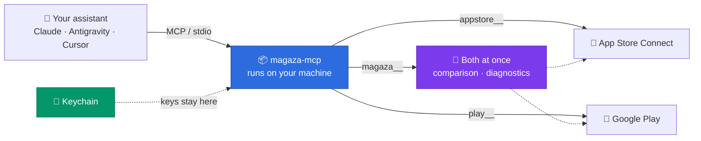

<div align="center">

# Mağaza MCP

**App Store Connect and Google Play, in one MCP server.**
Let your AI assistant manage both stores.

[](https://www.npmjs.com/package/magaza-mcp)
[](https://github.com/tunaarikaya/magaza-mcp/actions/workflows/ci.yml)
[](https://github.com/tunaarikaya/magaza-mcp/stargazers)
[](LICENSE)
[](https://nodejs.org)

**You don't type anything into a terminal to install this.**
Drop this line on your AI assistant, it handles the rest:

```
https://github.com/tunaarikaya/magaza-mcp — install this, read AGENTS.md
```

[Türkçe README](README.tr.md)

</div>

---

> **You:** How much is Nota Defteri's monthly subscription on App Store vs. Play in Turkey?
>
> **Assistant:** ₺129.99 on the App Store, ₺99.99 on Play. Play is noticeably
> cheaper — if you want the same price in both stores, you need to update the
> base plan on Play.

No other MCP server can answer that in a single call, because they all look at
one store. `magaza-mcp` sees both at once.



No server sits in the middle: the package runs on your own machine, talks
directly to Apple and Google, and your keys never leave your Keychain.

---

## 📚 Table of contents

| | |
| --- | --- |
| [🎯 Why this exists](#-why-this-exists) | The difference from single-store servers |
| [⚡ Setup](#-setup) | Have your assistant do it — you don't type commands |
| [🧑‍💻 Manual setup](#-manual-setup) | If you're not using an assistant |
| [🧩 Do the two stores mix up?](#-do-the-two-stores-mix-up) | No — here's why |
| [💬 What you can ask](#-what-you-can-ask) | Example prompts |
| [🧰 Tools](#-tools) | Full list of all 27 tools |
| [🌐 Full API access](#-full-api-access) | 1,440 operations, ~4,000 tokens |
| [🔑 Required permissions](#-required-permissions) | What Apple and Google require |
| [🔒 Security](#-security) | Keys, approval gates, telemetry |
| [🩺 Troubleshooting](#-troubleshooting) | Common errors |

---

## 🎯 Why this exists

Almost every MCP server on the market covers a single store. If you want
both, you install two separate servers, juggle two separate tool sets, and
manually stitch together any question that needs a comparison.

| Question | With single-store servers | With `magaza-mcp` |
| --- | --- | --- |
| "How much is this subscription in both stores?" | Two separate queries, manual comparison | One call, side by side |
| "User paid but didn't get premium, what's wrong?" | You figure out which store first | Scans both at once, ranks findings |
| "Where is what published?" | Two lists, manual matching | One list with iOS/Android pairs already matched |

The real win isn't more tools: **it's tools that can query both stores in the
same call, which is only possible once both are in one server.**

---

## ⚡ Setup

Tell your assistant (Claude Code, Antigravity, Cursor, Codex, Gemini CLI…):

```
https://github.com/tunaarikaya/magaza-mcp — install this, read AGENTS.md
```

The assistant reads [AGENTS.md](AGENTS.md) and handles the entire setup. All
you do is answer its questions:

```
You       › https://github.com/tunaarikaya/magaza-mcp — install this, read AGENTS.md

Assistant › Looking for your keys on this machine...

            Found two keys:
              App Store : ~/Downloads/AuthKey_ABC123DEFG.p8   (Key ID ABC123DEFG)
              Play      : ~/.config/play/account.json         (publish@project.iam...)

            Want me to use these? If there's another file, tell me the path,
            or copy the key and paste it — either works.

You       › yes, use them

Assistant › I need the Issuer ID for App Store. It's the UUID above the key
            list on App Store Connect → Users and Access → Integrations.

You       › 69a6de70-0000-0000-0000-000000000000

Assistant › ✓ App Store Connect connected — 4 apps found
            ✓ Google Play connected — 3 apps found
            ✓ Registered in Claude Code and Antigravity settings

            Restart Claude Code, then ask:
            "List my apps across both stores"
```

**If it can't find your key**, it will ask you how to proceed: give it the
file path, copy the key to your clipboard, or — if you don't have a key yet —
it'll walk you through getting one step by step.

> [!IMPORTANT]
> **The assistant never sees the contents of your key.** It runs the setup,
> but the commands take the file's **path**, read its contents themselves, and
> write it straight into the Keychain. Even when you paste the key via
> clipboard (`pbpaste | …`), the content flows through a pipe and never enters
> the assistant's context. AGENTS.md tells the assistant this explicitly.

After setup, restart any open applications — MCP servers only load at
startup.

<details>
<summary><b>Supported clients and config files</b></summary>

<br>

| Client | Config file |
| --- | --- |
| Claude Code | `~/.claude.json` |
| Claude Desktop | `~/Library/Application Support/Claude/claude_desktop_config.json` |
| Antigravity (IDE + CLI) | `~/.gemini/config/mcp_config.json` |
| Cursor | `~/.cursor/mcp.json` |
| Windsurf | `~/.codeium/windsurf/mcp_config.json` |
| Codex | `~/.codex/config.toml` |

Your existing config is left untouched — only the `magaza-mcp` entry is
added or updated, a `.magaza-mcp-yedek` backup is taken before every write,
and the write itself is atomic.

</details>

---

## 🧑‍💻 Manual setup

If you're not using an assistant, a wizard does the same job:

```bash
npx magaza-mcp kur
```

<details>
<summary><b>What does the wizard ask?</b></summary>

<br>

```
  Mağaza MCP setup
  App Store Connect + Google Play, in one setup

  1. Which stores should we connect?

     App Store Connect (iOS / macOS)? [Y/n] y
     Google Play (Android)? [Y/n] y

  2. App Store Connect key

     Key ID: ABC123DEFG
     Issuer ID: 00000000-0000-0000-0000-000000000000
     Path to .p8 file: ~/Downloads/AuthKey_ABC123DEFG.p8
     Connecting to Apple... ✓ 4 apps found
     ✓ Key saved (macOS Keychain)

  3. Google Play service account

     Path to service account JSON: ~/.config/play/account.json
     Connecting to Google... ✓ 3 apps found
     ✓ Key saved (macOS Keychain)

  4. Which clients should it be installed to?

     Claude Code? [Y/n] y
     Antigravity (IDE + CLI)? [Y/n] y
     Cursor? [y/N] n

  Setup complete.
```

| # | Question | Note |
| --- | --- | --- |
| 1 | Which stores? | App Store, Play, or both |
| 2 | App Store key | Key ID, Issuer ID, `.p8` path — verified with a real request to Apple before saving |
| 3 | Play service account | Path to the JSON key — also verified against Google |
| 4 | Which clients? | Clients detected on your machine come pre-checked |
| 5 | Read-only? | No by default |

</details>

**Keys are never written to the config file.** On macOS they're saved to the
Keychain; the config file only gets which stores are enabled (`MAGAZALAR`).
On systems without Keychain access, it falls back to a file with `0600`
permissions.

<details>
<summary><b>All commands</b></summary>

<br>

```bash
npx magaza-mcp tara        # Search the machine for .p8 and service account keys
npx magaza-mcp anahtar ... # Verify a key and write it to the vault (below)
npx magaza-mcp kaydet      # Register the server in clients' configs
npx magaza-mcp durum       # Show what's connected (--json for machine-readable)
npx magaza-mcp araclar     # List installed tools (✎ = can modify data)
npx magaza-mcp kur         # Manual setup wizard
npx magaza-mcp surum       # Print version
npx magaza-mcp yardim      # Help
```

Registering a key (the command-line equivalent of the wizard's Q&A step):

```bash
npx magaza-mcp anahtar --apple-p8 ~/Downloads/AuthKey_ABC123DEFG.p8 \
  --issuer-id 69a6de70-0000-0000-0000-000000000000

npx magaza-mcp anahtar --play-json ~/.config/play/account.json

pbpaste | npx magaza-mcp anahtar --play-json -   # from clipboard, no file
npx magaza-mcp anahtar --sil appstore            # remove from the vault
```

If `--key-id` isn't given, it's read from the filename. A key is never
written to the vault without being verified against Apple/Google with a real
request; if verification fails, the existing key in the vault is left
untouched.

</details>

---

## 🧩 Do the two stores mix up?

No — and that's not an accident, it's the design itself.

**1. Tool names are separated by prefix.** Every tool going to App Store
starts with `appstore__`, every tool going to Play starts with `play__`. A
tool never talks to both APIs. There's no shared name, so there's nothing to
mix up.

**2. Tools for the store you didn't pick are never loaded.** On startup, the
server reads the `MAGAZALAR` variable and builds the tool list from it — the
other store's tools aren't even loaded into memory, aren't shown to the
model, and cost zero tokens.

| Setup | Tools loaded |
| --- | --- |
| Both stores | 27 |
| App Store only | 14 |
| Play only | 13 |
| Read-only (both stores) | 24 |

**3. Cross-store tools only exist when both stores are enabled.** In a
single-store setup they're never created at all — they'd have no meaning.

**4. The dispatch tools know their scope too.** The `magaza` parameter on
`magaza__endpoint_ara` and `magaza__cagir` is an enum that only accepts the
stores you've set up. If you only installed Play, the model can't make a call
with `magaza: "appstore"` — the schema doesn't allow it.

---

## 💬 What you can ask

The app names in the examples are made up; you'd use your own app's name.

**Both stores at once**

- *"List my apps across both stores — where's each one published?"*
- *"What's Nota Defteri's monthly subscription on App Store vs. Play in Turkey? Is there a difference?"*
- *"A user says they paid but didn't get premium. Check the purchase setup in both stores."*

**App Store**

- *"Which of my versions is stuck in review?"*
- *"Did yesterday's TestFlight build finish processing?"*
- *"Summarize the 1- and 2-star reviews from the last week — what's the most common complaint?"*
- *"Update the 'What's New' text for the version in preparation."*

**Google Play**

- *"Which version is on the production channel and what percentage of users does it reach?"*
- *"Has the crash rate gone up over the last 14 days?"*
- *"Is this purchase token valid, is the subscription still active?"*
- *"Draft a polite reply to this review, but show me first."*

---

## 🧰 Tools

The prefix tells you which store a tool goes to. Tools marked **✎** modify
data and won't run without `onayla=true`.

<details open>
<summary><b>Both stores at once — 3 tools</b> · <i>the heart of the project</i></summary>

<br>

These tools only load when both stores are connected.

| Tool | What it does |
| --- | --- |
| `magaza__genel_bakis` | Collects apps from both stores into one list; puts the iOS/Android pair of the same product side by side, and separates out apps that only exist in one store. |
| `magaza__abonelik_karsilastir` | Compares the same app's subscriptions across both stores: product IDs, durations, and prices in the requested country. Converts the country code to whichever format each store expects. |
| `magaza__iap_teshis` | Diagnoses "paid but no premium" issues: are the products live, do they have a price in that country, is the plan open to new subscribers; if you give it a Play purchase token it verifies that too, and writes up its findings as a list. |

</details>

<details>
<summary><b>App Store Connect — 11 tools</b> (<code>appstore__</code>)</summary>

<br>

| Tool | What it does |
| --- | --- |
| `appstore__uygulamalar` | Lists the apps on the account: name, bundle ID, SKU, primary language, and the `id` other tools need. |
| `appstore__surumler` | Shows an app's App Store versions and their status (in preparation, in review, live, rejected). |
| `appstore__buildler` | Lists TestFlight builds, their processing status, and expiry dates. |
| `appstore__yorumlar` | Fetches customer reviews, newest first; filterable by rating and country, or only the ones without a reply yet. Shows the existing developer response if there is one. |
| `appstore__yorum_yanitla` ✎ | Writes a developer response to a review (published after Apple's moderation). |
| `appstore__abonelikler` | Lists subscription groups and the subscriptions in them: product ID, duration, status. |
| `appstore__abonelik_fiyatlari` | Fetches a subscription's customer price and developer proceeds, country by country. |
| `appstore__iap_urunler` | Lists one-time in-app purchase products. |
| `appstore__testflight_gruplari` | Shows TestFlight beta groups, how many testers are in each, public invite links, and quotas. |
| `appstore__metin_guncelle` ✎ | Updates the store text of the version in preparation: release notes, description, keywords, promotional text. |
| `appstore__satis_raporu` | Downloads the sales/download report as TSV: daily, weekly, monthly, or yearly; sales, pre-order, installs, subscriptions, subscription events, subscribers, and offer code reports. |

</details>

<details>
<summary><b>Google Play — 10 tools</b> (<code>play__</code>)</summary>

<br>

| Tool | What it does |
| --- | --- |
| `play__uygulamalar` | Lists the apps the service account can access; this is where you get the package name other tools need. |
| `play__kanallar` | Shows release channels (internal, alpha, beta, production) and the versions on each, with user rollout percentages. Requires the service account to have release-management permission. |
| `play__yorumlar` | Fetches user reviews, translating them if asked. The Play API only returns roughly the last week. |
| `play__yorum_yanitla` ✎ | Writes a developer response to a review (350 characters max). |
| `play__abonelikler` | Lists subscriptions and their base plans: duration, status, number of priced countries. Includes archived ones if asked. |
| `play__abonelik_fiyatlari` | Fetches a base plan's prices country by country, and whether it's open to new subscribers; also checks the "rest of world" fallback price for countries not listed individually. |
| `play__urunler` | Lists one-time products; tries both the new (`oneTimeProducts`) and legacy (`inappproducts`) models. |
| `play__satin_alma_dogrula` | Verifies a purchase token: subscription status, acknowledgment status, expiry date, whether it's a test purchase. |
| `play__iade_edilenler` | Lists cancelled, refunded, or charged-back purchases; turns the refund reason and source into something readable. Google only returns the last 30 days. |
| `play__cokme_orani` | Fetches Android vitals crash rate day by day, along with the number of distinct users in the measurement. |

</details>

<details>
<summary><b>Full API access — 3 tools</b> (<code>magaza__</code>)</summary>

<br>

| Tool | What it does |
| --- | --- |
| `magaza__endpoint_ara` | Searches for an endpoint across all connected stores' APIs; returns the operation name, HTTP method, path, and parameters. |
| `magaza__cagir` ✎ | Runs the operation you found. Fills in path parameters automatically; operations that modify data won't run without `onayla=true`. |
| `magaza__sema` | Shows what an operation's request body should look like; used before POST/PATCH calls. |

`magaza__cagir` is marked ✎ here because it can also run operations that
modify data. In `npx magaza-mcp araclar` output it doesn't show ✎ though:
since it's also the single gateway to every read endpoint in the catalog, it
isn't dropped from the list in read-only mode — only write operations through
it are blocked.

</details>

---

## 🌐 Full API access

The curated tools cover most day-to-day work. For everything else, the server
carries the **entire** API surface of both stores:

| Source | Operations |
| --- | --- |
| App Store Connect API v4.5 | 1,270 |
| Android Publisher API v3 | 145 |
| Play Developer Reporting API v1beta1 | 25 |
| **Total** | **1,440** |

When the curated tools aren't enough, the model first finds the operation it
needs with `magaza__endpoint_ara`, then runs it with `magaza__cagir`.

### Why aren't they all separate tools?

MCP tool definitions get loaded into context **on every request** — the
installed tool list is paid for again on every message, even if you don't use
any of them.

| | Tools | Paid on every message |
| --- | --- | --- |
| **magaza-mcp** | 27 | **~4,000 tokens** |
| If all were separate tools | 1,440 | ~210,000 tokens |

> [!NOTE]
> Nothing is locked away: all 1,440 operations are reachable, but the ones
> you don't use cost nothing. There's no "should I turn this feature on, it
> costs tokens" setting either — there's nothing to turn on.

The catalogs are generated from Apple's and Google's **official
specifications**: Apple's published App Store Connect OpenAPI file, and
Google's Android Publisher and Play Developer Reporting discovery documents.
There's no hand-written endpoint list. The 159 operations Apple marks as
deprecated aren't dropped from the catalog — some of them are the only way to
reach that capability — but their summaries start with `[ESKİMİŞ]`
(deprecated) and are pushed down in search results.

---

## 🔑 Required permissions

**App Store Connect** — The **App Manager** role is enough when creating the
key; Admin isn't required. Exceptions: user/access management endpoints and
some analytics reports need higher privileges.

**Google Play** — Both steps are required:

1. The service account must be invited from **Play Console → Users and
   permissions** and granted access to the relevant apps.
2. The **Android Publisher API** and **Play Developer Reporting API** must be
   enabled on the Cloud project. App listing and crash metrics come from the
   Reporting API, so the second one is genuinely required too.

> [!WARNING]
> Contract, tax, and banking information **cannot be read with any API key.**
> Apple never exposes this data to the API at all; only the Account Holder can
> see it in the dashboard.

---

## 🔒 Security

- **Keys live in the Keychain.** The Apple `.p8` and Google service account
  JSON are stored in the macOS Keychain; never written to config files,
  environment variables, or the repo.
- **The assistant never sees the key, even when it runs the setup.** The
  `anahtar` command takes the file's path, reads the content itself, and
  writes it straight to the vault; a key given via clipboard also flows
  through a pipe. The key's content never appears in any command's output —
  `durum` only prints the last four characters of the Key ID, `tara` only
  prints file paths.
- **Operations that modify data require approval.** Write tools don't run on
  the first call: they return what would happen and the expected request
  body; the operation only runs once the user approves and it's called again
  with `onayla=true`. This is enforced **server-side** — it doesn't depend on
  the client's approval UI.
- **Read-only mode.** `--salt-okunur` (or `SALT_OKUNUR=1`) removes every
  write-capable tool from the list entirely: the model can't see them or call
  them. 27 tools become 24. `magaza__cagir` stays in the list because it's
  also the single gateway for read endpoints in the catalog — but it refuses
  write operations when read-only mode is on.
- **Path parameters are validated.** IDs passed to tools are encoded before
  entering a URL; path-traversal attempts like `.` and `..` are rejected. For
  absolute URLs the target host is validated, so no request can carry a token
  to anywhere other than Apple or Google.
- **Clients can see which tools modify data.** The tool list ships with MCP
  `annotations` (`readOnlyHint`, `destructiveHint`).
- **Package provenance is verifiable.** Every version published to npm is
  built inside GitHub Actions, and npm generates a Sigstore-signed provenance
  attestation: the **Provenance** section on the npm page shows which commit
  in this repo the tarball you downloaded was built from. No publish token is
  stored in the repo; GitHub issues a short-lived, signed identity on every
  release (trusted publishing), so there's no publish key to steal either.
- **No telemetry.** No analytics, error reports, or usage data are sent.
  Network traffic only goes to `api.appstoreconnect.apple.com`,
  `androidpublisher.googleapis.com`, `playdeveloperreporting.googleapis.com`,
  and `oauth2.googleapis.com` for tokens. There's no server in the middle;
  data flows directly between your machine and Apple/Google.

---

## 🩺 Troubleshooting

<details>
<summary><b>Apple returns 401</b></summary>

<br>

The Key ID, Issuer ID, and `.p8` file might not belong together — all three
need to be from the same key. If they match, check the system clock: the
signed JWT lives 20 minutes, and a token produced on a machine with a drifted
clock gets rejected by Apple. Also make sure the `.p8` file is an **App Store
Connect API key** — StoreKit or push keys don't work here.

</details>

<details>
<summary><b>Apple returns 403</b></summary>

<br>

The key's role isn't sufficient for that operation. App Manager covers most
things; user management and some reports need more.

Worth knowing upfront: **contract, tax, and banking information can't be read
with any API key.** A 403 here isn't a misconfiguration, it can't be fixed.

</details>

<details>
<summary><b>Play returns 403 on the <code>inappproducts</code> endpoint</b></summary>

<br>

The app has moved to Google's new product model; the legacy `inappproducts`
endpoint is now closed and `oneTimeProducts` should be used instead. The
`play__urunler` tool handles this itself: it tries the new endpoint first,
falls back to the legacy one if needed, and tells you in the output which
model it used.

</details>

<details>
<summary><b>Play returns 403 in general</b></summary>

<br>

The service account may not have been invited to the app in Play Console.
After inviting it, permissions can take a few minutes to propagate. If the
invite is already in place, verify that Android Publisher API and Play
Developer Reporting API are enabled on the Cloud project.

</details>

<details>
<summary><b>Why does "list my Play apps" come from the Reporting API?</b></summary>

<br>

Because the Android Publisher API **has no app-listing endpoint** — Google
never published one. Since no Publisher call can be made without knowing the
package name, the list is pulled from the Play Developer Reporting API's
`apps:search` endpoint instead. That's why the Reporting API needs to be
enabled not just for crash metrics, but for basic usage too.

</details>

<details>
<summary><b>Why is Play's version/channel info sometimes delayed?</b></summary>

<br>

On Play, channel information can only be read from within an "edit session."
The read tools open this session themselves, read from it, and leave it
without committing — so it creates no changes — but it does mean two extra
HTTP calls.

</details>

---

## 🛠 Development

```bash
git clone https://github.com/tunaarikaya/magaza-mcp.git
cd magaza-mcp
npm install
npm run build      # Compile TypeScript
npm run kontrol    # Type-check (tsc --noEmit)
npm run dev        # Compile in watch mode
```

To regenerate the tool catalogs from the specs:

```bash
node scripts/uret-katalog.mjs
```

This reads the three spec files under `spec/` and rewrites the catalogs under
`src/katalog/`. The operation list is never hand-edited.

---

## 🤝 Similar projects

There are good projects in this space that came before this one. If your
needs are limited to a single store, we genuinely recommend looking at them:

- **[Heimdall](https://github.com/erayendes/app-store-connect-mcp)** — Covers
  the entire App Store Connect API with 890 tools, with a profile system that
  lets you narrow the tool set down. The deepest project in this space if
  you're only interested in iOS.
- **[app-store-connect-mcp-server](https://github.com/JoshuaRileyDev/app-store-connect-mcp-server)**
  — The first one. Established the idea of putting App Store Connect behind
  an MCP server; everyone who came after owes something to it.
- **[google-play-developer-mcp](https://github.com/devinwang/google-play-developer-mcp)**
  — A comprehensive, mature server on the Play side. More than enough if
  you're only publishing on Android.

Our difference: all of these look at a single store. `magaza-mcp` combines
both in one setup and offers tools that can compare both stores in the same
call — exactly what a single-store server can't do.

---

## 📄 License

MIT — see [LICENSE](LICENSE) for details. See
[THIRD-PARTY-NOTICES.md](THIRD-PARTY-NOTICES.md) for third-party sources.

App Store, TestFlight, App Store Connect, Google Play, and Play Console are
trademarks of their respective owners. This is an independent open-source
project; it is not affiliated with, endorsed, sponsored, or supported by
Apple Inc. or Google LLC.
