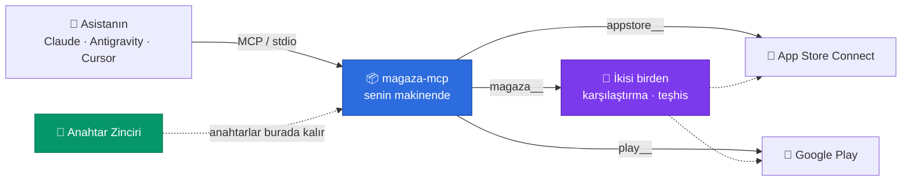

<div align="center">

# Mağaza MCP

**App Store Connect ve Google Play, tek MCP sunucusunda.**
Yapay zekâ asistanın iki mağazayı da yönetsin.

[](https://www.npmjs.com/package/magaza-mcp)
[](https://github.com/tunaarikaya/magaza-mcp/actions/workflows/ci.yml)
[](https://github.com/tunaarikaya/magaza-mcp/stargazers)
[](LICENSE)
[](https://nodejs.org)

**Kurmak için terminale hiçbir şey yazmıyorsun.**
Yapay zekâ asistanına şu satırı at, gerisini o halleder:

```
https://github.com/tunaarikaya/magaza-mcp — bunu kur, AGENTS.md'yi oku
```

</div>

---

> **Sen:** Nota Defteri'nin aylık aboneliği App Store'da ve Play'de Türkiye'de kaç para?
>
> **Asistan:** App Store'da ₺129,99, Play'de ₺99,99. Play tarafı belirgin biçimde
> daha ucuz — iki mağazada aynı fiyatı istiyorsan Play'deki temel planı
> güncellemen gerekiyor.

Bu soruyu tek çağrıda cevaplayabilen başka bir MCP sunucusu yok, çünkü hepsi tek
mağazaya bakıyor. `magaza-mcp` ikisini aynı anda görür.



Araya giren sunucu yok: paket senin makinende çalışır, doğrudan Apple ve
Google ile konuşur, anahtarın Anahtar Zinciri'nden dışarı çıkmaz.

---

## 📚 İçindekiler

| | |
| --- | --- |
| [🎯 Neden bu var?](#-neden-bu-var) | Tek mağazalı sunucularla farkı |
| [⚡ Kurulum](#-kurulum) | Asistanına yaptır — sen komut yazmıyorsun |
| [🧑‍💻 Elle kurulum](#-elle-kurulum) | Asistan kullanmıyorsan |
| [🧩 İki mağaza karışır mı?](#-iki-mağaza-karışır-mı) | Hayır — nedeni burada |
| [💬 Ne sorabilirsin](#-ne-sorabilirsin) | Örnek komutlar |
| [🧰 Araçlar](#-araçlar) | 27 aracın tam listesi |
| [🌐 Tam API erişimi](#-tam-api-erişimi) | 1440 operasyon, ~4.000 token |
| [🔑 Gereken izinler](#-gereken-izinler) | Apple ve Google tarafında ne şart |
| [🔒 Güvenlik](#-güvenlik) | Anahtarlar, onay kapıları, telemetri |
| [🩺 Sorun giderme](#-sorun-giderme) | Sık karşılaşılan hatalar |

---

## 🎯 Neden bu var?

Piyasadaki MCP sunucularının neredeyse hepsi tek mağazalı. İkisini birden
kullanmak istiyorsan iki ayrı sunucu kurar, iki ayrı araç setiyle uğraşır ve
karşılaştırma gerektiren her soruyu elle birleştirirsin.

| Soru | Tek mağazalı sunucularla | `magaza-mcp` ile |
| --- | --- | --- |
| "Bu abonelik iki mağazada kaça?" | İki ayrı sorgu, elle karşılaştırma | Tek çağrı, yan yana |
| "Kullanıcı ödedi ama premium yok, sorun nerede?" | Hangi mağaza olduğunu önce sen bulacaksın | İkisini birden tarar, bulguları sıralar |
| "Nerede neyim yayında?" | İki liste, elle eşleştirme | iOS/Android eşleri eşleştirilmiş tek liste |

Asıl kazanç araç sayısının artması değil: **iki mağazayı aynı çağrıda
sorgulayabilen araçlar ancak böyle mümkün oluyor.**

---

## ⚡ Kurulum

Asistanına (Claude Code, Antigravity, Cursor, Codex, Gemini CLI…) bunu yaz:

```
https://github.com/tunaarikaya/magaza-mcp — bunu kur, AGENTS.md'yi oku
```

Asistan [AGENTS.md](AGENTS.md)'yi okur ve kurulumun tamamını üstlenir. Senin
yapman gereken tek şey sorularına cevap vermek:

```
Sen  › https://github.com/tunaarikaya/magaza-mcp — bunu kur, AGENTS.md'yi oku

Asistan › Anahtarlarını makinende arıyorum...

          Makinende iki anahtar buldum:
            App Store : ~/Downloads/AuthKey_ABC123DEFG.p8   (Key ID ABC123DEFG)
            Play      : ~/.config/play/hesap.json           (yayin@proje.iam...)

          Bunları kullanayım mı? Başka bir dosya varsa yolunu söyle,
          ya da anahtarı kopyalayıp bana at — ikisi de olur.

Sen  › evet, kullan

Asistan › App Store için Issuer ID lazım. App Store Connect → Kullanıcılar ve
          Erişim → Entegrasyonlar sayfasında, anahtar listesinin üstündeki UUID.

Sen  › 69a6de70-0000-0000-0000-000000000000

Asistan › ✓ App Store Connect bağlandı — 4 uygulama görüldü
          ✓ Google Play bağlandı — 3 uygulama görüldü
          ✓ Claude Code ve Antigravity ayarlarına kaydedildi

          Claude Code'u yeniden başlat, sonra şunu sor:
          "İki mağazadaki uygulamalarımı listele"
```

**Anahtarını bulamazsa** ne yapacağını sorar: dosyanın yolunu söylersin,
panona kopyalarsın, ya da anahtarın hiç yoksa nereden alacağını adım adım
anlatır.

> [!IMPORTANT]
> **Anahtarının içeriğini asistan görmez.** Kurulumu o yapar ama komutlar
> dosyanın yolunu alır, içeriğini kendileri okuyup doğrudan Anahtar Zinciri'ne
> yazar. Anahtarı panondan verdiğinde bile (`pbpaste | …`) içerik borudan
> geçer, asistanın bağlamına girmez. AGENTS.md bunu asistana açıkça söyler.

Kurulumdan sonra açık olan uygulamaları yeniden başlat — MCP sunucuları
yalnızca açılışta yüklenir.

<details>
<summary><b>Desteklenen istemciler ve ayar dosyaları</b></summary>

<br>

| İstemci | Ayar dosyası |
| --- | --- |
| Claude Code | `~/.claude.json` |
| Claude Desktop | `~/Library/Application Support/Claude/claude_desktop_config.json` |
| Antigravity (IDE + CLI) | `~/.gemini/config/mcp_config.json` |
| Cursor | `~/.cursor/mcp.json` |
| Windsurf | `~/.codeium/windsurf/mcp_config.json` |
| Codex | `~/.codex/config.toml` |

Mevcut ayarlarına dokunulmaz — yalnızca `magaza-mcp` girdisi eklenir veya
güncellenir, her yazmadan önce `.magaza-mcp-yedek` kopyası alınır ve yazma
atomik yapılır.

</details>

---

## 🧑‍💻 Elle kurulum

Asistan kullanmıyorsan sihirbaz aynı işi yapar:

```bash
npx magaza-mcp kur
```

<details>
<summary><b>Sihirbaz ne soruyor?</b></summary>

<br>

```
  Mağaza MCP kurulumu
  App Store Connect + Google Play, tek kurulumda

  1. Hangi mağazaları bağlayalım?

     App Store Connect (iOS / macOS)? [E/h] e
     Google Play (Android)? [E/h] e

  2. App Store Connect anahtarı

     Key ID: ABC123DEFG
     Issuer ID: 00000000-0000-0000-0000-000000000000
     .p8 dosyasının yolu: ~/Downloads/AuthKey_ABC123DEFG.p8
     Apple'a bağlanılıyor... ✓ 4 uygulama görüldü
     ✓ Anahtar kaydedildi (macOS Anahtar Zinciri)

  3. Google Play servis hesabı

     Servis hesabı JSON yolu: ~/.config/play/hesap.json
     Google'a bağlanılıyor... ✓ 3 uygulama görüldü
     ✓ Anahtar kaydedildi (macOS Anahtar Zinciri)

  4. Hangi uygulamalara kurulsun?

     Claude Code? [E/h] e
     Antigravity (IDE + CLI)? [E/h] e
     Cursor? [e/H] h

  Kurulum tamam.
```

| # | Soru | Not |
| --- | --- | --- |
| 1 | Hangi mağazalar? | App Store, Play veya ikisi |
| 2 | App Store anahtarı | Key ID, Issuer ID, `.p8` yolu — kaydetmeden önce Apple'a gerçek istek atıp doğrular |
| 3 | Play servis hesabı | JSON anahtarının yolu — bu da Google'a karşı doğrulanır |
| 4 | Hangi istemcilere? | Makinende kurulu görünenler işaretli gelir |
| 5 | Salt-okunur olsun mu? | Varsayılan hayır |

</details>

**Anahtarların ayar dosyasına yazılmaz.** macOS'ta Anahtar Zinciri'ne kaydedilir;
ayar dosyasına yalnızca hangi mağazaların açık olduğu (`MAGAZALAR`) girer.
Anahtar Zinciri'ne erişilemeyen sistemlerde izinleri `0600` olan bir dosyaya
düşülür.

<details>
<summary><b>Bütün komutlar</b></summary>

<br>

```bash
npx magaza-mcp tara        # Makinede .p8 ve servis hesabı anahtarı ara
npx magaza-mcp anahtar ... # Anahtarı doğrula ve kasaya yaz (aşağıda)
npx magaza-mcp kaydet      # Sunucuyu istemcilerin ayarlarına ekle
npx magaza-mcp durum       # Neyin bağlı olduğunu göster (--json ile makine okunur)
npx magaza-mcp araclar     # Yüklü araçları listele (✎ = veri değiştirebilir)
npx magaza-mcp kur         # Elle kurulum sihirbazı
npx magaza-mcp surum       # Sürümü yazdır
npx magaza-mcp yardim      # Yardım
```

Anahtar kaydı (sihirbazın soru-cevap kısmının komut karşılığı):

```bash
npx magaza-mcp anahtar --apple-p8 ~/Downloads/AuthKey_ABC123DEFG.p8 \
  --issuer-id 69a6de70-0000-0000-0000-000000000000

npx magaza-mcp anahtar --play-json ~/.config/play/hesap.json

pbpaste | npx magaza-mcp anahtar --play-json -   # panodan, dosya olmadan
npx magaza-mcp anahtar --sil appstore            # kasadan sil
```

`--key-id` verilmezse dosya adından okunur. Anahtar, Apple/Google'a gerçek bir
istek atılarak doğrulanmadan kasaya yazılmaz; doğrulama başarısızsa kasadaki
eski anahtar olduğu gibi kalır.

</details>

---

## 🧩 İki mağaza karışır mı?

Hayır — ve bu tesadüf değil, tasarımın kendisi.

**1. Araç isimleri önekle ayrılmıştır.** App Store'a giden her araç `appstore__`,
Play'e giden her araç `play__` ile başlar. Bir araç asla iki API'ye birden
gitmez. Ortak isim olmadığı için karışma ihtimali de yok.

**2. Seçmediğin mağazanın araçları hiç yüklenmez.** Sunucu açılışta `MAGAZALAR`
değişkenini okur ve listeyi ona göre kurar — seçmediğin mağazanın araçları
belleğe bile alınmaz, modele gösterilmez, token harcamaz.

| Kurulum | Yüklenen araç |
| --- | --- |
| İki mağaza | 27 |
| Yalnızca App Store | 14 |
| Yalnızca Play | 13 |
| Salt-okunur (iki mağaza) | 24 |

**3. Çapraz araçlar yalnızca iki mağaza da açıkken var olur.** Tek mağazalı
kurulumda hiç oluşturulmazlar — anlamları olmadığı için.

**4. Dispatch araçları da kapsamını bilir.** `magaza__endpoint_ara` ve
`magaza__cagir` araçlarının `magaza` parametresi, yalnızca kurduğun mağazaları
kabul eden bir enum'dur. Sadece Play kurduysan model `magaza: "appstore"` diye
bir çağrı yapamaz; şema buna izin vermez.

---

## 💬 Ne sorabilirsin

Örneklerdeki uygulama adları uydurmadır; sen kendi uygulamalarının adını
kullanırsın.

**İki mağaza birden**

- *"İki mağazadaki uygulamalarımı listele, hangisi nerede yayında?"*
- *"Nota Defteri'nin aylık aboneliği App Store'da ve Play'de Türkiye'de kaç para? Fark var mı?"*
- *"Bir kullanıcı ödeme yaptığını ama premium açılmadığını söylüyor. İki mağazada da satın alma kurulumunu kontrol et."*

**App Store**

- *"Hangi sürümüm incelemede takıldı?"*
- *"Dün yüklediğim TestFlight build'inin işlenmesi bitti mi?"*
- *"Son bir haftadaki 1 ve 2 yıldızlı yorumları özetle, en sık şikâyet ne?"*
- *"Hazırlanmakta olan sürümün 'Bu sürümde neler yeni' metnini güncelle."*

**Google Play**

- *"Hangi sürüm production kanalında ve yüzde kaç kullanıcıya açık?"*
- *"Çökme oranı son 14 günde arttı mı?"*
- *"Bu satın alma token'ı geçerli mi, abonelik hâlâ aktif mi?"*
- *"Şu yoruma kibar bir yanıt yaz, ama önce bana göster."*

---

## 🧰 Araçlar

Önek hangi mağazaya gidildiğini söyler. **✎** işaretli araçlar veri değiştirir
ve `onayla=true` gelmeden çalışmaz.

<details open>
<summary><b>İki mağaza birden — 3 araç</b> · <i>projenin can damarı</i></summary>

<br>

Bu araçlar yalnızca iki mağaza da bağlıyken yüklenir.

| Araç | Ne yapar |
| --- | --- |
| `magaza__genel_bakis` | İki mağazadaki uygulamaları tek listede toplar; aynı ürünün iOS/Android eşlerini yan yana koyar, sadece tek mağazada olanları ayırır. |
| `magaza__abonelik_karsilastir` | Aynı uygulamanın aboneliklerini iki mağazada karşılaştırır: ürün kimlikleri, süreler ve istenen ülkedeki fiyatlar. Ülke kodunu iki mağazanın istediği biçime kendi çevirir. |
| `magaza__iap_teshis` | "Ödedi ama premium göremiyor" sorunlarını teşhis eder: ürünler yayında mı, o ülkede fiyatı var mı, plan yeni abonelere açık mı; Play satın alma token'ı verirsen onu da doğrular ve bulguları madde madde yazar. |

</details>

<details>
<summary><b>App Store Connect — 11 araç</b> (<code>appstore__</code>)</summary>

<br>

| Araç | Ne yapar |
| --- | --- |
| `appstore__uygulamalar` | Hesaptaki uygulamaları listeler: ad, bundle ID, SKU, birincil dil ve diğer araçların istediği `id`. |
| `appstore__surumler` | Bir uygulamanın App Store sürümlerini ve durumlarını gösterir (hazırlanıyor, incelemede, yayında, reddedildi). |
| `appstore__buildler` | TestFlight build'lerini, işlenme durumlarını ve son kullanma tarihlerini listeler. |
| `appstore__yorumlar` | Müşteri yorumlarını en yeniden eskiye getirir; puana ve ülkeye göre süzülebilir, istersen yalnızca henüz yanıtlanmamışları verir. Varsa mevcut geliştirici yanıtını da gösterir. |
| `appstore__yorum_yanitla` ✎ | Bir yoruma geliştirici yanıtı yazar (Apple incelemesinden sonra yayınlanır). |
| `appstore__abonelikler` | Abonelik gruplarını ve içlerindeki abonelikleri listeler: ürün kimliği, süre, durum. |
| `appstore__abonelik_fiyatlari` | Bir aboneliğin ülke ülke müşteri fiyatlarını ve geliştirici gelirini getirir. |
| `appstore__iap_urunler` | Tek seferlik uygulama içi satın alma ürünlerini listeler. |
| `appstore__testflight_gruplari` | TestFlight beta gruplarını, her gruptaki test kullanıcı sayısını, genel davet linklerini ve kotalarını gösterir. |
| `appstore__metin_guncelle` ✎ | Hazırlanmakta olan sürümün mağaza metinlerini günceller: sürüm notları, açıklama, anahtar kelimeler, tanıtım metni. |
| `appstore__satis_raporu` | Satış/indirme raporunu TSV olarak indirir: günlük, haftalık, aylık veya yıllık; satış, ön sipariş, yükleme, abonelik, abonelik olayı, abone ve teklif kodu raporları. |

</details>

<details>
<summary><b>Google Play — 10 araç</b> (<code>play__</code>)</summary>

<br>

| Araç | Ne yapar |
| --- | --- |
| `play__uygulamalar` | Servis hesabının eriştiği uygulamaları listeler; diğer araçların istediği paket adını buradan alırsın. |
| `play__kanallar` | Yayın kanallarını (internal, alpha, beta, production) ve her kanaldaki sürümleri, kullanıcı yüzdeleriyle birlikte gösterir. Servis hesabının sürüm yönetme yetkisi gerekir. |
| `play__yorumlar` | Kullanıcı yorumlarını getirir; istenirse çevirir. Play API'si yalnızca son ~1 haftayı verir. |
| `play__yorum_yanitla` ✎ | Bir yoruma geliştirici yanıtı yazar (en fazla 350 karakter). |
| `play__abonelikler` | Abonelikleri ve temel planlarını (base plan) listeler: süre, durum, fiyatlandırılan ülke sayısı. Arşivlenmişleri istersen dahil eder. |
| `play__abonelik_fiyatlari` | Bir temel planın ülke ülke fiyatlarını ve yeni abonelere açık olup olmadığını getirir; tek tek listelenmemiş ülkeler için "diğer bölgeler" yedek fiyatına da bakar. |
| `play__urunler` | Tek seferlik ürünleri listeler; yeni (`oneTimeProducts`) ve eski (`inappproducts`) modelin ikisini de dener. |
| `play__satin_alma_dogrula` | Bir satın alma token'ını doğrular: abonelik durumu, onay durumu, bitiş tarihi, test satın alması mı. |
| `play__iade_edilenler` | İptal edilmiş, iade edilmiş veya geri alınmış satın almaları listeler; iade sebebini ve kaynağını okunur hale getirir. Google yalnızca son 30 günü verir. |
| `play__cokme_orani` | Android vitals çökme oranını, ölçüme giren farklı kullanıcı sayısıyla birlikte günlük olarak getirir. |

</details>

<details>
<summary><b>Tüm API'ye erişim — 3 araç</b> (<code>magaza__</code>)</summary>

<br>

| Araç | Ne yapar |
| --- | --- |
| `magaza__endpoint_ara` | Bağlı mağazaların API'lerinin tamamında uç nokta arar; operasyon adını, HTTP yöntemini, yolunu ve parametrelerini döndürür. |
| `magaza__cagir` ✎ | Bulunan operasyonu çalıştırır. Yol parametrelerini otomatik yerine koyar; veri değiştiren işlemler `onayla=true` olmadan çalışmaz. |
| `magaza__sema` | Bir operasyonun istek gövdesinin nasıl olması gerektiğini gösterir; POST/PATCH çağrılarından önce kullanılır. |

`magaza__cagir` burada ✎ ile işaretli, çünkü veri değiştiren operasyonları da
çalıştırabilir. Buna karşılık `npx magaza-mcp araclar` çıktısında ✎ görünmez:
araç aynı zamanda katalogdaki bütün okuma uçlarının tek kapısı olduğu için
salt-okunur modda listeden düşmez, yalnızca yazma operasyonları kapatılır.

</details>

---

## 🌐 Tam API erişimi

Seçilmiş araçlar günlük işin büyük kısmını görür. Geri kalanı için sunucu iki
mağazanın API'lerinin **tamamını** taşır:

| Kaynak | Operasyon |
| --- | --- |
| App Store Connect API v4.5 | 1270 |
| Android Publisher API v3 | 145 |
| Play Developer Reporting API v1beta1 | 25 |
| **Toplam** | **1440** |

Hazır araçlar yetmediğinde model önce `magaza__endpoint_ara` ile aradığı işlemi
bulur, sonra `magaza__cagir` ile çalıştırır.

### Neden hepsi ayrı araç değil?

MCP araç tanımları **her istekte** bağlama girer — yani yüklü araç listesi, sen
hiçbirini kullanmasan bile her mesajda yeniden ödenir.

| | Araç | Her mesajda ödenen |
| --- | --- | --- |
| **magaza-mcp** | 27 | **~4.000 token** |
| Hepsi ayrı araç olsaydı | 1440 | ~210.000 token |

> [!NOTE]
> Kapalı özellik yok: 1440 operasyonun tamamına erişilebiliyor, ama
> kullanılmayanın maliyeti sıfır. Bu yüzden "şu özelliği açayım mı, token yer"
> diye bir ayar da yok — açılacak bir şey yok.

Kataloglar Apple ve Google'ın **resmî spesifikasyonlarından** üretilir: Apple'ın
yayınladığı App Store Connect OpenAPI dosyası ile Google'ın Android Publisher ve
Play Developer Reporting discovery dökümanları. Elle yazılmış uç nokta listesi
yoktur. Apple'ın eskimiş (deprecated) işaretlediği 159 operasyon katalogdan
atılmaz — bazıları o yeteneğe giden tek yol — ama özetleri `[ESKİMİŞ]` ile
başlar ve arama sonuçlarında geriye itilir.

---

## 🔑 Gereken izinler

**App Store Connect** — Anahtarı oluştururken **App Manager** rolü yeterlidir;
Admin gerekmez. İstisnalar: kullanıcı ve erişim yönetimi uç noktaları ile bazı
analitik raporlar daha yüksek yetki ister.

**Google Play** — İki adım da şart:

1. Servis hesabının **Play Console → Kullanıcılar ve izinler**'den davet
   edilmesi ve ilgili uygulamalara izin verilmesi.
2. Cloud projesinde **Android Publisher API** ve **Play Developer Reporting
   API**'nin etkinleştirilmiş olması. Uygulama listelemesi ve çökme metrikleri
   Reporting API'sinden geldiği için ikincisi de gerçekten gereklidir.

> [!WARNING]
> Sözleşme, vergi ve banka bilgileri **hiçbir API anahtarıyla okunamaz.** Apple
> bu verileri API'ye hiç açmaz; yalnızca Hesap Sahibi arayüzden görebilir.

---

## 🔒 Güvenlik

- **Anahtarlar Anahtar Zinciri'nde.** Apple `.p8` ve Google servis hesabı JSON'u
  macOS Anahtar Zinciri'nde saklanır; ayar dosyalarına, ortam değişkenlerine
  veya repoya yazılmaz.
- **Kurulumu asistan yapsa bile anahtarı görmez.** `anahtar` komutu dosyanın
  yolunu alır, içeriği kendisi okur ve doğrudan kasaya yazar; panodan verilen
  anahtar da borudan geçer. Anahtarın içeriği hiçbir komutun çıktısında
  görünmez — `durum` yalnızca Key ID'nin son dört hanesini, `tara` yalnızca
  dosya yollarını basar.
- **Veri değiştiren işlemler onay ister.** Yazma araçları ilk seferde çalışmaz:
  ne yapılacağını ve beklenen gövdeyi döndürürler; işlem ancak kullanıcı
  onayladıktan sonra `onayla=true` ile tekrarlandığında yürür. Bu **sunucu
  tarafında** uygulanır — istemcinin onay arayüzüne bağlı değildir.
- **Salt-okunur mod.** `--salt-okunur` (veya `SALT_OKUNUR=1`) yazma yapan
  araçları listeden tamamen çıkarır: model onları göremez, çağıramaz. 27 araç
  24'e düşer. `magaza__cagir` listede kalır çünkü okuma uçlarının da tek
  kapısıdır — ama yazma operasyonu istendiğinde reddeder.
- **Yol parametreleri doğrulanır.** Araçlara verilen kimlikler URL'e girmeden
  önce kodlanır; `.` ve `..` gibi yol gezinme denemeleri reddedilir. Mutlak
  adreslerde hedef host doğrulanır, böylece hiçbir istek Apple ve Google
  dışındaki bir adrese token taşıyamaz.
- **İstemci hangi aracın veri değiştirdiğini görür.** Araç listesi MCP
  `annotations` alanlarıyla (`readOnlyHint`, `destructiveHint`) birlikte verilir.
- **Paket kaynağı kanıtlanabilir.** npm'e yayınlanan her sürüm GitHub Actions
  içinde derlenir ve npm, Sigstore ile imzalı bir köken belgesi (provenance)
  üretir: npm sayfasındaki **Provenance** bölümü, indirdiğin tarball'ın bu
  depodaki hangi commit'ten üretildiğini gösterir. Yayın için depoda saklanan
  bir token yoktur; GitHub her yayında kısa ömürlü, imzalı bir kimlik üretir
  (trusted publishing), dolayısıyla çalınacak bir yayın anahtarı da yoktur.
- **Telemetri yok.** Hiçbir analitik, hata raporu veya kullanım verisi
  gönderilmez. Ağ trafiği yalnızca `api.appstoreconnect.apple.com`,
  `androidpublisher.googleapis.com`, `playdeveloperreporting.googleapis.com` ve
  token için `oauth2.googleapis.com` adreslerine gider. Araya giren bir sunucu
  yoktur; veri doğrudan senin makinenle Apple ve Google arasında akar.

---

## 🩺 Sorun giderme

<details>
<summary><b>Apple 401 döndürüyor</b></summary>

<br>

Key ID, Issuer ID ve `.p8` dosyası birbirine ait olmayabilir — üçü aynı anahtara
ait olmalı. Uyuşuyorlarsa sistem saatine bak: imzalanan JWT 20 dakika ömürlüdür
ve saati kaymış bir makinede üretilen token Apple tarafından reddedilir. Ayrıca
`.p8` dosyasının bir **App Store Connect API anahtarı** olduğundan emin ol;
StoreKit veya push anahtarları burada çalışmaz.

</details>

<details>
<summary><b>Apple 403 döndürüyor</b></summary>

<br>

Anahtarın rolü o işlem için yetersiz. App Manager çoğu şeye yeter; kullanıcı
yönetimi ve bazı raporlar daha fazlasını ister.

Ama bir şeyi baştan bilmekte fayda var: **sözleşme, vergi ve banka bilgileri
hiçbir API anahtarıyla okunamaz.** Buradaki 403 bir yapılandırma hatası
değildir, düzeltilemez.

</details>

<details>
<summary><b>Play 403 döndürüyor, <code>inappproducts</code> uç noktasında</b></summary>

<br>

Uygulama Google'ın yeni ürün modeline geçmiştir; eski `inappproducts` uç noktası
artık kapalıdır ve `oneTimeProducts` kullanılmalıdır. `play__urunler` aracı bunu
kendisi halleder: önce yeni uç noktayı dener, olmazsa eskisine düşer ve hangi
modeli kullandığını çıktıda söyler.

</details>

<details>
<summary><b>Play 403 döndürüyor, genel olarak</b></summary>

<br>

Servis hesabı Play Console'da uygulamaya davet edilmemiş olabilir. Davet ettikten
sonra izinlerin yayılması birkaç dakika sürebilir. Davet tamamsa Cloud projesinde
Android Publisher API ve Play Developer Reporting API'nin açık olduğunu doğrula.

</details>

<details>
<summary><b>"Play uygulamalarımı listele" neden Reporting API'sinden geliyor?</b></summary>

<br>

Çünkü Android Publisher API'sinde uygulama listeleme uç noktası **yoktur** —
Google böyle bir uç nokta hiç yayınlamadı. Paket adını bilmeden hiçbir Publisher
çağrısı yapılamadığı için liste, Play Developer Reporting API'sinin `apps:search`
uç noktasından alınır. Bu yüzden Reporting API'si sadece çökme metrikleri için
değil, temel kullanım için de açık olmalıdır.

</details>

<details>
<summary><b>Play'de sürüm/kanal bilgisi neden bazen gecikiyor?</b></summary>

<br>

Play'de kanal bilgisi ancak bir "düzenleme oturumu" (edit) içinden okunabilir.
Okuma araçları bu oturumu kendileri açar, okur ve commit etmeden bırakır — yani
hiçbir değişiklik yaratmaz — ama bu fazladan iki HTTP çağrısı demektir.

</details>

---

## 🛠 Geliştirme

```bash
git clone https://github.com/tunaarikaya/magaza-mcp.git
cd magaza-mcp
npm install
npm run build      # TypeScript derle
npm run kontrol    # Tip kontrolü (tsc --noEmit)
npm run dev        # İzleme modunda derleme
```

Araç kataloglarını spesifikasyonlardan yeniden üretmek için:

```bash
node scripts/uret-katalog.mjs
```

`spec/` altındaki üç spesifikasyon dosyasını okur ve `src/katalog/` altındaki
katalogları yeniden yazar. Operasyon listesi elle düzenlenmez.

---

## 🤝 Benzer projeler

Bu alanda önce yola çıkmış, iyi iş yapan projeler var. İhtiyacın tek mağazayla
sınırlıysa bunlara bakmanı içtenlikle öneririz:

- **[Heimdall](https://github.com/erayendes/app-store-connect-mcp)** — App Store
  Connect API'sinin tamamını 890 araçla kapsayan, profil sistemiyle araç setini
  daraltmana izin veren çok kapsamlı bir sunucu. Sadece iOS tarafıyla
  ilgileniyorsan bu alandaki en derin proje.
- **[app-store-connect-mcp-server](https://github.com/JoshuaRileyDev/app-store-connect-mcp-server)**
  — Alanın ilki. App Store Connect'i bir MCP sunucusunun arkasına koyma fikrini
  ilk kuran proje; sonradan gelen herkes bir şekilde buna borçlu.
- **[google-play-developer-mcp](https://github.com/devinwang/google-play-developer-mcp)**
  — Play tarafında kapsamlı ve olgun bir sunucu. Yalnızca Android yayınlıyorsan
  işini fazlasıyla görür.

Farkımız şu: bu projelerin hepsi tek mağazaya bakar. `magaza-mcp` ikisini tek
kurulumda birleştirir ve iki mağazayı aynı çağrıda karşılaştırabilen araçlar
sunar — tek mağazalı bir sunucuda yapılamayan şey tam olarak budur.

---

## 📄 Lisans

MIT — ayrıntılar için [LICENSE](LICENSE). Üçüncü taraf kaynaklar için
[THIRD-PARTY-NOTICES.md](THIRD-PARTY-NOTICES.md).

App Store, TestFlight, App Store Connect, Google Play ve Play Console adları
sahiplerinin tescilli markalarıdır. Bu proje bağımsız bir açık kaynak
çalışmasıdır; Apple Inc. veya Google LLC ile bağlantılı değildir, onlar
tarafından onaylanmamış, desteklenmemiş veya sponsor edilmemiştir.
